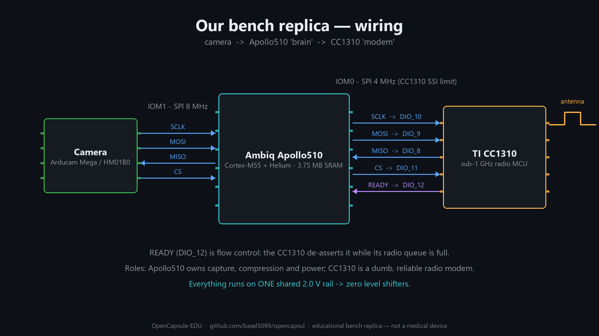
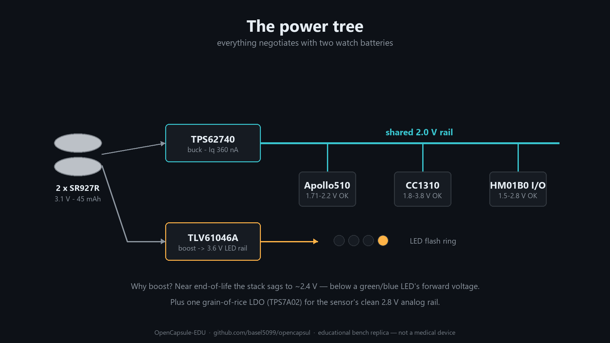

# Processor Choice: Ambiq Apollo510 — rationale, dev boards, camera, and wiring plan

This document records the architecture decision for the processing unit between the
camera sensor and the CC1310 radio, and gives the concrete connection plan.

```
[camera sensor] ──► [Apollo510 — "the brain"] ──SPI──► [CC1310 — "the RF modem"] ──► antenna
                         │
                         └── frame triage (edge AI), compression, power FSM
```

---

## 1. Why Apollo510?

The real capsule solved "sensor → compressed bits" with a custom ASIC (LJ215C in our
teardown) because no 2015-era MCU could do it within the power budget. In 2026 the
Apollo510 closes that gap with silicon you can buy in single quantities:

| Requirement (from teardown + power budget) | Apollo510 (datasheet DS-A510-0p9p2) | Verdict |
|---|---|---|
| Milliwatt-class active processing | **35.3 µW/MHz** @ 96 MHz LP mode (Table 40) → ~1.9 mA while working | ✅ best-in-class |
| Microamp-class sleep between frames | **23.8 µW deep sleep** with 160 KB retained (~13 µA) | ✅ |
| Hold entire frames without external RAM | **3.75 MB SRAM/TCM** — ~36 uncompressed 320×320 frames | ✅ huge margin |
| Compress a frame in a few ms | Cortex-M55 @ 96/250 MHz with **Helium** vector ISA, >120 CoreMark/mJ | ✅ software JPEG ≪ frame period |
| Talk to CC1310 | 8× IOM SPI/I²C managers + SPI subordinate port | ✅ trivial |
| Fit the capsule concept | WLCSP 4.9 × 4.7 mm | ✅ smaller than CC1310 |
| **Bonus** the ASIC never had | Run a tiny CNN per frame → *skip transmitting dark/blurred/duplicate frames*. Radio is the most expensive subsystem — sending fewer frames saves far more than the Apollo costs | 🚀 upgrade over the original |

**Accepted weaknesses (and mitigations):**

1. **No camera interface** (no MIPI-CSI / DVP — the MIPI it has is DSI, display *output*).
   → Mitigation: use an SPI camera (§3).
2. **Core supply is 1.71–2.2 V only** (Table 35) — cannot hang directly on our 3.1 V
   battery stack like the CC1310 can.
   → Mitigation: one shared 2.0 V rail for Apollo **and** CC1310 (§5). Bonus: same-rail
   SPI needs no level shifters.
3. **BGA (6.6×6.6) / WLCSP (4.9×4.7) packages** — not hand-solderable.
   → Mitigation: official EVB for Phases 1–2; assembly service for Phase 3.

Rejected alternatives, for the record: STM32U5 (has DCMI camera IF but ~5× worse
µA/MHz, less RAM), MAX78000 (camera IF + CNN, but weaker toolchain/community and
higher active current), ESP32-S3 (cheap and easy but ~10–40 mA class — bench only),
iCE40 UP5K FPGA (kept as a community stretch goal — closest experience to designing
the real ASIC).

---

## 2. Development hardware

| Board | Price (2026) | Why |
|---|---|---|
| **Ambiq AP510EVB** (Apollo510 EVB Rev 2.2) | ~$245 @ DigiKey | On-board **J-Link** debugger, USB-C, PSRAM/octal-flash, **MikroBUS socket** (SPI/I²C/UART broken out — we wire the camera there). Supported in **Zephyr** and Keil MDK |
| 2× **TI LAUNCHXL-CC1310** | ~$30 each | TX modem + RX receiver; XDS110 debugger on board |
| 1× **Arducam Mega 3 MP** | ~$40 | Bench camera (§3) |
| 2× **TXB0104 level-shifter breakouts** | ~$3 each | The EVB GPIO domains run ≤2.2 V; the LaunchPad runs 3.3 V by default, the Mega wants 3.3–5 V. Shift both bench links (or re-jumper the LaunchPad to an external 2.0 V VDDS and shift only the camera) |
| Nordic **PPK2** | ~$100 | Current profiling — the point of the whole exercise |

---

## 3. Camera sensor choice — the two-camera strategy

The bench-friendly camera and the battery-friendly camera are different parts. Use both,
in different phases:

| | **Arducam Mega 3 MP SPI** (Phases 1–2) | **Himax HM01B0** (Phase 3) |
|---|---|---|
| Interface | Plain SPI ≤ 8 MHz, 6 wires | 1/4/8-bit source-clocked serial (needs capture trick, see below) |
| Compression | **JPEG inside the module** | None — raw Bayer out; Apollo does JPEG in software (Helium: a few ms/frame) |
| Resolution | up to 2048×1536, configurable down to 320×240 | **320×320 native** — same class as the real capsule |
| Supply | 3.3–5 V | 1.8 V-class rails |
| Power | **~200 mW active** (~60 mA @3.3 V); sleep modes, wake ≤100 ms | **< 2 mW** @ QVGA 30 fps; ~µW standby |
| Battery verdict | ~6–12 mA average at 1–2 fps even duty-cycled → **bench/USB only** (or ~6 h demo at 0.5 fps with hard power-gating) | Fits the 4.5 mA budget with room to spare |
| Effort | Days — vendor SDK is a simple C driver | The project's hardest step |

**HM01B0 capture on a chip with no camera port — solved by precedent.** The
**SparkFun Edge** board (2019) paired an Ambiq **Apollo3 Blue** — same HAL family, no
camera interface — with the HM01B0, and its open-source driver is exactly the recipe
we need: MCLK generated from a CTimer, control over I²C, and frame readout in **8-bit
mode via plain GPIO reads** (config `HM01B0_RAW8_QVGA_8bits_lsb_5fps` — 5 fps on a
48 MHz Apollo3). Port `third_party/hm01b0/HM01B0.c` from
[SparkFun_Apollo3_AmbiqSuite_BSPs](https://github.com/sparkfun/SparkFun_Apollo3_AmbiqSuite_BSPs/tree/master/common/third_party/hm01b0)
to the Apollo510 (2–5× the clock, vastly more RAM) and our 1–2 fps target has huge
margin. This de-risks Phase 3 from "experiment" to "porting exercise".
Supply detail: HM01B0 rails are I/O **1.5–2.8 V** (✓ our shared 2.0 V rail) but analog
**AVDD 2.8 V** — add a grain-of-rice LDO from the battery (TI **TPS7A02**, 1.0×1.0 mm —
the very part the Apollo510 datasheet recommends for auxiliary rails). Note: HM01B0 is
**monochrome**; acceptable for the learning goals, and honest to flag vs. the color
sensor in the real capsule.
Fallback if porting stalls: keep the Mega with aggressive power gating and accept a
shorter "mission time" (the power-budget doc's math still gets taught, just with worse
numbers).

**Color options (the real capsule is color; HM01B0 is mono):**

1. **Himax HM0360, Bayer RGB variant** — the color sibling in the same always-on
   family: 640×480 (windowable to QVGA), **~140 µA @ QVGA 2 fps**, <500 µW in binned
   3 fps mode, 14.5 mW at VGA 60 fps; same I²C + 8/4-bit interface style, plus frame
   trigger/auto-wake extras. Caveat: off-the-shelf modules (Arducam RP2040 module,
   Arduino ecosystem) ship the **monochrome** CFA — ordering the color variant means
   sourcing the Bayer-CFA part explicitly; Apollo-side work adds demosaicing (fast
   with Helium). This is the primary color path.
2. **Sequential-RGB illumination + monochrome sensor** — replace the white flash LEDs
   with R/G/B LEDs, capture three mono frames per color image, combine on the Apollo.
   Field-sequential color is a real endoscopy technique; costs 3× capture energy and
   shows color fringing on motion — an excellent Phase-4 experiment using hardware we
   already control (the LED ring).
3. **GC2145 / OV7675** (color DVP sensors): ~100–180 mW class — bench-only, same
   verdict as the Arducam Mega.

---

## 4. Wiring plan



### 4.1 Bench (Phase 1–2): EVB + LaunchPad + Mega

```
                    3.3V domain                         ≤2.2V domain              3.3V domain
              ┌───────────────────┐              ┌──────────────────────┐   ┌──────────────────┐
              │ Arducam Mega 3MP  │              │  Apollo510 EVB       │   │ CC1310 LaunchPad │
              │  VCC ── 3V3       │              │                      │   │  (TX "capsule")  │
              │  SCK ◄────────────┼──[TXB0104]───┼─ IOM1 SCLK (MikroBUS)│   │                  │
              │  MOSI ◄───────────┼──[TXB0104]───┼─ IOM1 MOSI           │   │                  │
              │  MISO ────────────┼──[TXB0104]──►┼─ IOM1 MISO           │   │                  │
              │  CS  ◄────────────┼──[TXB0104]───┼─ IOM1 CS             │   │                  │
              └───────────────────┘              │                      │   │                  │
                                                 │ IOM0 SCLK ───[TXB]───┼──►│ DIO_10  SSI0 CLK │
                                                 │ IOM0 MOSI ───[TXB]───┼──►│ DIO_9   SSI0 RX  │
                                                 │ IOM0 MISO ◄──[TXB]───┼───│ DIO_8   SSI0 TX  │
                                                 │ IOM0 CS   ───[TXB]───┼──►│ DIO_11  SSI0 CS  │
                                                 │ GPIO IRQ  ◄──[TXB]───┼───│ DIO_12  "READY"  │
                                                 │ GND ─────────────────┼───│ GND (common!)    │
                                                 └──────────────────────┘   └──────────────────┘
                                                                             DIO_8..12 = standard
                                                                             BoosterPack SPI map
```

- **Common ground first** — three boards, three USB supplies; tie grounds before signals.
- CC1310 **SSI subordinate max is 4 MHz** (datasheet §6.9) — clock IOM0 at 4 MHz.
  Camera link (IOM1) can run 8 MHz.
- Level-shifter alternative: power the LaunchPad target rail at 2.0 V externally
  (remove the 3V3 jumpers, feed VDDS from a bench supply) and drop the TXB0104s on
  that link — closer to the final design, slightly more fiddly with the XDS110.

### 4.2 The Apollo↔CC1310 protocol (roles)

- **CC1310 firmware = dumb RF modem.** SPI subordinate with µDMA ring buffer; every
  received 122-byte `cap_chunk_t` (see `firmware/README.md`) goes straight into the RF
  driver TX queue. It owns nothing else. **READY (DIO_12)** de-asserts while its queue
  is full — Apollo polls it before each chunk. Radio profile and duty limits stay
  entirely inside the CC1310.
- **Apollo510 firmware = the brain.** Power FSM (deep sleep → wake on RTC), camera
  driver, optional CNN triage ("send / skip"), JPEG handling, chunking + CRC16,
  battery/temperature telemetry injection. Zephyr has official `apollo510_evb` support;
  Ambiq's AmbiqSuite is the bare-metal alternative.
- Keep the wire format identical to `firmware/README.md` so the RX LaunchPad + Python
  viewer need **zero changes** when the brain board appears.

### 4.3 Battery build (Phase 3): one shared rail



```
2× SR927R (3.1 V → 2.4 V EOL)
        │
   TPS62740 buck (Iq 360 nA), VOUT = 2.0 V ──┬── Apollo510 VDDP/VDDH/VDDA  (1.71–2.2 V ✓)
        │                                    ├── CC1310 VDDS               (1.8–3.8 V ✓)
        │                                    └── HM01B0 I/O rail           (✓)
        └── (LED flash rail: switched directly from battery via FET)
```

- **One 2.0 V rail = zero level shifters** — every SPI wire in §4.1 becomes a direct
  trace. That's why 2.0 V and not 1.8 V: margin above CC1310's 1.8 V minimum across
  battery life and pulse droop.
- Apollo needs its own **2.2 µH SIMO-buck inductor** (Murata DFE201210U-2R2M, 0805) +
  bypass network, a **48 MHz crystal**, and 32.768 kHz crystal — per datasheet §30.2.2.
- CC1310 TX at **0 dBm** on this rail (higher PA settings want more headroom; 0 dBm is
  the bench-legal choice anyway).

### 4.4 System power check (battery build, 1 fps, HM01B0 path)

| Consumer | Duty | Average |
|---|---|---|
| HM01B0 capture | continuous-capable, gated | ~0.3 mA |
| Apollo510: 15 ms JPEG+triage @96 MHz | 1.5 % | ~0.03 mA |
| Apollo510 deep sleep | 98.5 % | ~0.015 mA |
| CC1310: ~10 KB frame @ 500 kbps PHY ≈ 170 ms TX @ 10.5 mA | 17 % | ~1.8 mA |
| CC1310 standby + PMU quiescents | — | ~0.05 mA |
| LED flash (4× LEDs, 5 ms/frame) | 0.5 % | ~0.1 mA |
| **Total** | | **≈ 2.3 mA → ~19 h from 45 mAh** ✅ |

(The radio dominates — exactly like the real capsule. Raise the PHY rate or add AI
frame-skipping and the number improves further; that trade-off study is Milestone M7.)

---

## 5. Action checklist

- [ ] Order: AP510EVB, 2× LAUNCHXL-CC1310, Arducam Mega 3MP, TXB0104 ×2, PPK2
- [ ] Bring up Zephyr `apollo510_evb` blinky + deep-sleep current measurement (PPK2)
- [ ] Mega on IOM1: capture JPEG to RAM, dump over debug UART
- [ ] CC1310 "modem" firmware: SPI-subordinate ring buffer → RF queue + READY pin
- [ ] End-to-end: Mega → Apollo → CC1310 → air → LaunchPad RX → Python viewer
- [ ] Power FSM + measurements vs. §4.4 table
- [ ] Phase-3 spike: HM01B0 1-bit capture into I²S-subordinate/SPI-subordinate (go/no-go)

## References

- Apollo510 SoC Datasheet DS-A510-0p9p2 (voltages: Table 35; currents: Table 40; SIMO
  inductor: §30.2.2): <https://mm.digikey.com/Volume0/opasdata/d220001/medias/docus/7170/Apollo510-SoC-Datasheet-v0_9_2.pdf>
- AP510EVB product page: <https://www.digikey.com/en/products/detail/ambiq-micro-inc/AP510EVB/24712055>
- Zephyr board support: <https://docs.zephyrproject.org/latest/boards/ambiq/apollo510_evb/doc/index.html>
- Arducam Mega SPI camera docs: <https://docs.arducam.com/Arduino-SPI-camera/MEGA-SPI/MEGA-SPI-Camera/>
- TI CC1310 datasheet SWRS181D (SSI 4 MHz limit §6.9; VDDS range): <https://www.ti.com/lit/ds/symlink/cc1310.pdf>
