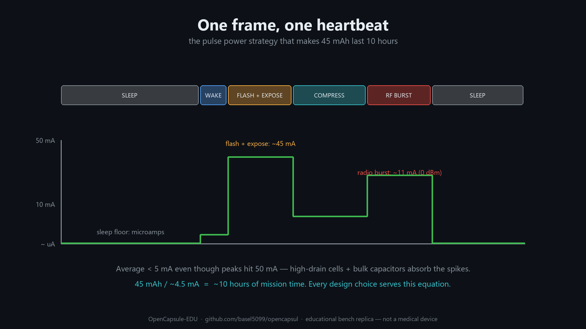

# Power Budget — the math that shapes the whole device



The single most important lesson of capsule design: **the battery is the product;
everything else negotiates with it.** This document walks the numbers, then shows
how to measure your own build against them.

## 1. The energy source

Two Murata SR927R silver-oxide cells in series:

| Parameter | Value |
|---|---|
| Voltage (fresh, series) | 3.1 V (2 × 1.55 V) |
| Capacity | **45 mAh** (series capacity does not add) |
| Chemistry | Silver-oxide — very flat discharge curve |
| Variant | **R = high drain**: sustains ~50 mA pulses at ≥ 1 V/cell |
| Total energy | ≈ 3.0 V × 45 mAh ≈ **0.14 Wh** |

Why silver-oxide and not lithium primary?
- Flat voltage until nearly empty → electronics see a stable rail all mission long.
- Safer chemistry for a device designed to be inside a person (the *real* device;
  ours never is).
- Excellent volumetric energy at milliamp-class average currents.

Why the high-drain (R) variant despite 25 % less capacity than the watch variant?
Because capacity you cannot pull out during a 50 mA pulse is worthless — a standard
watch cell's internal resistance would sag below brown-out during every flash+burst.

## 2. The mission requirement

Gastro-intestinal transit time: **8–12 hours**. Design target 10 h:

```
I_avg(max) = 45 mAh / 10 h = 4.5 mA average — the whole system, everything included.
```

## 3. The pulse profile

Per frame (a few frames per second), the system does:

```
sleep ──► wake ──► LED flash + expose ──► readout + compress ──► RF burst ──► sleep
          <1 ms        ~1–5 ms                ~10–30 ms            ~5–20 ms
```

Rough peak-current stack during the worst overlap (numbers from datasheets and
typical parts, for intuition — measure your own):

| Consumer | Peak |
|---|---|
| 4× white LEDs (pulsed) | ~20 mA |
| CC1310 TX @ +10 dBm (datasheet) | ~13.4 mA |
| CC1310 TX @ 0 dBm (datasheet) | ~10.5 mA |
| Sensor + ASIC active | ~10 mA |
| **Worst-case peak** | **~40–50 mA** |

That peak is ~10× the average budget — which is fine, because it only lasts
milliseconds. Duty cycling is the entire game:

```
Example @ 2 fps:
  active 40 ms/frame × 2 = 80 ms/s at ~30 mA  → 2.4 mA contribution
  sleep  920 ms/s at ~0.1 mA (regulators + RTC) → 0.1 mA
  ─────────────────────────────────────────────
  average ≈ 2.5 mA  ✓ (comfortably under 4.5 mA → margin for 4–6 fps bursts)
```

## 4. The three-layer pulse strategy (as found in the real capsule)

1. **High-drain cell** — low internal resistance, tolerates the pulse.
2. **Bulk capacitors on the PMU board** — recharge slowly between frames, dump into
   the pulse, halving what the battery sees at peak.
   Sizing intuition: ΔV = I·Δt/C → to supply 30 mA for 20 ms with 100 mV droop you
   need C ≈ 30 mA × 20 ms / 0.1 V = **6 mF-class** distributed capacitance — in
   practice split across the pulse rails and assisted by the battery, so hundreds of
   µF of ceramics/tantalum suffice. Measure the droop; that's the exercise.
3. **Switching regulation** — CC1310's internal DC/DC plus board bucks keep
   conversion losses low; the CC1310 itself runs *directly* from the stack
   (VDDS = 1.8–3.8 V) so its rail costs zero conversion loss.

## 5. CC1310-specific numbers to design against (datasheet SWRS181D)

| Mode | Typical current |
|---|---|
| Standby (RTC on, RAM retained) | 0.6 µA |
| Active MCU 48 MHz (CoreMark) | ~1.5 mA |
| Radio RX | 5.5 mA |
| Radio TX @ 0 dBm | 10.5 mA |
| Radio TX @ +10 dBm | 13.4 mA |
| Sensor Controller running | ~0.4–0.8 mA (µA-class per wake in practice) |

Design consequences:
- Prefer **0 dBm** for bench links; +10 dBm nearly triples nothing else but adds 3 mA
  to every burst.
- Use the **Sensor Controller** or RTC to wake the system; the M3 sleeps between frames.
- Move camera SPI data with **µDMA**; the M3 stays mostly idle even during readout.

## 6. Data-rate sanity check (why compression is mandatory)

Uncompressed 320×320 @ 8-bit Bayer = 102 KB/frame. At 2 fps = 1.6 Mbps *sustained* —
close to the radio's practical ceiling and catastrophic for power (radio on ~40 % of
the time). With ~10:1 JPEG: **~10 KB/frame → 160 kbps at 2 fps**, i.e. radio-on time
of ~4 % at 4 Mbps, or comfortable margin at lower, more robust PHY rates.
That is why the real capsule has a compression ASIC and why our replica uses a
camera module with built-in JPEG.

## 7. Measure, don't trust

The point of the project is to *verify* this table on your own build:

- **Nordic Power Profiler Kit II (PPK2)** (~$100) — logs µA→mA at 100 kS/s; ideal for
  seeing the sleep floor and the pulse shape. Budget alternative: a µCurrent + scope,
  or a 10 Ω shunt + differential scope probe (mind burden voltage at peaks).
- Deliverables per milestone: a current-vs-time screenshot of one full frame cycle,
  the computed average, and projected runtime from 45 mAh.
- Stretch: log battery voltage sag during pulses with the CC1310's own **battery
  monitor** (it's built in — the real capsule almost certainly telemeters this too).
