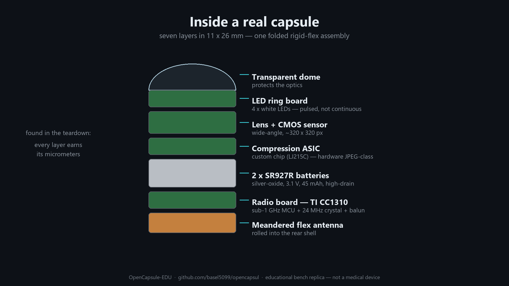
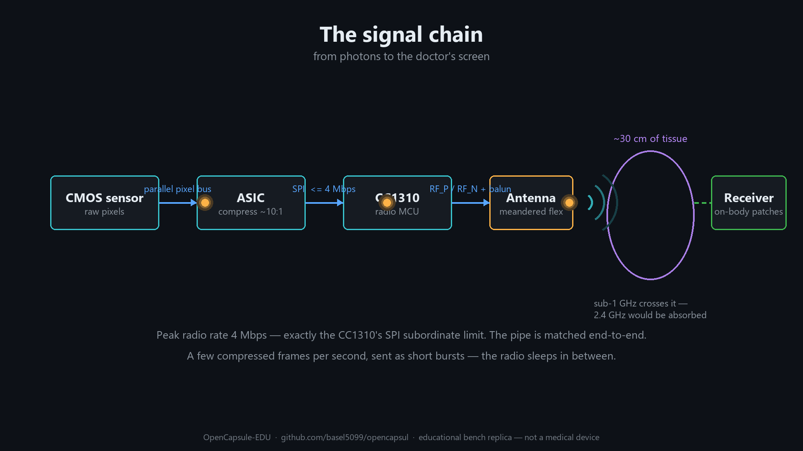

# Teardown Analysis — Commercial Wireless Capsule Endoscope




This document records a component-level teardown of an unbranded commercial capsule
endoscope (likely a recent Chinese design, post-2016), cross-checked against public
datasheets. It is the evidence base for the OpenCapsule-EDU architecture.

> Photos referenced below live in `docs/img/` — add your teardown photos there
> (`01-radio-board.jpg`, `02-stack-side.jpg`, … ) when publishing.

---

## 1. Mechanical construction

The entire electronic assembly is **one rigid-flex strip**: four round rigid PCB
islands (~10 mm diameter) on a continuous flex substrate, folded accordion-style
into the shell. Assembly order, dome to tail:

```
[transparent dome]
[LED ring board]        annular PCB, central hole for the lens barrel
[camera board]          wide-angle lens assembly over a CMOS sensor
[power-management board]
[2× SR927R coin cells]  side-by-side with the PMU, contacted by welded tabs/pillars
[radio board]           CC1310 on one face, compression ASIC on the other
[meandered flex antenna] rolled into a cylinder lining the rear shell
```

Mechanical details worth copying:

- **Keying lobes** on each round board force correct angular alignment during assembly.
- **Metal interconnect pillars** run past the batteries to carry power/signals end-to-end.
- Boards are double-sided; the radio board is effectively the "motherboard" with a
  processor on each face.

## 2. Radio board — face A: TI CC1310F128

Markings: `CC1310 F128 / TI / 09I C5F3 G4`.

- **CC1310F128RHB** — SimpleLink sub-1 GHz wireless MCU, 128 KB flash variant,
  5 × 5 mm RHB (VQFN-32) package, 15 DIOs.
- Internals (datasheet SWRS181D): ARM **Cortex-M3** @ 48 MHz application CPU,
  **Cortex-M0** radio processor, autonomous **Sensor Controller**, 20 KB SRAM.
- Supply range **1.8–3.8 V** → runs *directly* from the 3.1 V battery stack, no
  regulator in between. Integrated DC/DC generates the internal 1.7–1.95 V VDDR rail.

Support components identified around it (all required by the datasheet's
application circuit, section 7.1):

| Datasheet requirement | Observed on board |
|---|---|
| 24 MHz crystal on X24M_N/P (pins 30/31); load caps are **on-chip** | Metal-can crystal marked `TL240` (= 24.0 MHz); no external load caps — matches |
| Differential RF_P/RF_N (pins 1/2) → balun + filter + DC-block → 50 Ω antenna | Dense LC cluster between the IC and the flex-antenna tail |
| External inductor on DCDC_SW (pin 17) for the internal buck | Single larger inductor adjacent to the IC |
| Optional 32.768 kHz crystal (X32K_Q1/Q2) | **Absent** — internal 32 kHz RC used instead (saves space) |
| 2-wire cJTAG (JTAG_TMSC/TCKC, pins 13/14) | Routed to factory test pads |

## 3. Radio board — face B: the compression ASIC

Markings: `LJ215C` with an unidentified circular logo, ~QFN-32/40, plus a smaller
QFN (likely SPI flash or SRAM frame buffer) and a **second** metal-can crystal.

- The part number matches **no public catalog** (searched distributors and marking
  databases) → almost certainly a **custom ASIC**: sensor readout + image compression.
- This matches the published architecture of capsule systems: *CMOS sensor + low-power
  controlling/processing ASIC + RF transceiver* (Xie et al., PubMed 23853159; Khan &
  Wahid, PMC 4279511).
- A custom ASIC implies volume production — this is a mass-produced commercial design,
  not a prototype.

**Inferred data path:** the CC1310's SSI (SPI) peripherals run to **4 MHz max**, and its
radio's max over-the-air rate is **4 Mbps** — a matched pipe. With the 32-channel µDMA
moving SPI data to RAM without CPU involvement, the plausible chain is:

```
CMOS sensor → parallel pixel bus → LJ215C (compress) → SPI @ ≤4 MHz → CC1310 µDMA → radio burst
```

## 4. Camera board

- **Bare-die / CSP CMOS sensor**, active array ~2.5 × 2.5 mm with visible Bayer
  filter iridescence; chip-on-board class mounting to save every millimeter.
  Estimated resolution class: 320×320–400×400, large (~6 µm) pixels for low-light
  sensitivity.
- **Multi-element wide-angle lens** in a black barrel, small fixed aperture → large
  depth of field, no focus mechanism (nothing to focus with in a tumbling pill).
- Sensor is mounted slightly **off-center**; the lens holder compensates. The freed
  edge routes the flex and supply filtering.
- Decoupling caps hug the sensor — analog supply noise prints directly into the image.

## 5. LED ring board

- Annular PCB, central hole for the lens barrel; **4× phosphor-white LEDs** at 90°
  spacing plus one smaller device — likely a **photodiode** for auto-exposure
  (flash-energy control), possibly a fifth special-purpose emitter.
- Mounting the LEDs on a separate ring *in front of* the lens plane reduces lens flare
  and gives even illumination of the intestinal wall.
- LEDs flash only during exposure — one of the three pillars of the power budget.

## 6. Power-management board

Sits face-to-face with the battery stack (direct solder tabs top and bottom).

- Several **SOT-23-5/6 regulators/switches** (markings `M204`, `RP` — the `RP` device is
  plausibly a Ricoh RPxxx-family ultra-low-quiescent LDO; markings not conclusively
  identifiable, as is normal for SMD codes).
- **Inductors** → at least one switching converter for the low-voltage ASIC/sensor rails.
- **Large bulk capacitors** — the pulse reservoir (see power-budget doc).
- Expected but not visually confirmed: a **magnetic switch** (Hall/reed) for
  keep-off-in-package behavior; standard in commercial capsules and this board is
  its natural home.

Resulting rail plan (inferred):

```
2× SR927R = 3.1 V ──┬── direct → CC1310 (VDDS 1.8–3.8 V tolerant)
                    ├── buck/LDO → ~2.8 V analog → CMOS sensor
                    ├── buck     → core rail    → LJ215C ASIC
                    └── switched → LED flash rail (pulsed)
```

## 7. Batteries

Markings: `muRata SR927R / Hg0% / JAPAN / +`.

- **Murata SR927R**: silver-oxide, 1.55 V nominal, Ø9.5 × 2.7 mm, ~0.78 g,
  −10…+60 °C, **45 mAh**, mercury-free.
- The **R suffix = high-drain variant**: trades capacity (45 vs 60 mAh of the watch
  variant) for the ability to deliver **~50 mA pulses** while holding voltage — exactly
  the flash+burst load profile of this device. Murata's own medical-device material
  cites this cell class for pulsed medical loads.
- Two in series: 3.1 V; capacity stays 45 mAh. Battery diameter (9.5 mm) is what sets
  the capsule diameter (~11 mm shell).

## 8. Antenna

- **Meandered wide-trace antenna printed on the flex tail**, rolled into a cylinder at
  the rear of the shell — as far as mechanically possible from the battery cans
  (which block/detune RF).
- Meandering folds an electrically-long sub-GHz radiator (λ/4 at 433 MHz ≈ 17 cm)
  into centimeters of flex. Bandwidth and efficiency are sacrificed; through-tissue
  link budget is recovered by the low frequency itself.

## 9. System-level conclusions

1. **Sub-1 GHz is the medical choice**: body tissue (mostly water) absorbs 2.4 GHz
   heavily; 400–900 MHz crosses the abdomen with far less loss.
2. **Everything is pulsed**: capture → flash → compress → burst → sleep, a few times
   per second. Peak ≈ 40–50 mA, average ≈ 4–5 mA → ~10 h from 45 mAh.
3. **Three-layer pulse power strategy**: high-drain cell + bulk caps + efficient
   switching regulation.
4. **Hardware compression is non-negotiable** at this power level — a 48 MHz M3 cannot
   JPEG-compress video in real time within budget; hence the custom ASIC. (Our replica
   substitutes a camera module with built-in JPEG.)
5. **One rigid-flex assembly** eliminates connectors, wires, and hand assembly.

## References

- TI CC1310 datasheet SWRS181D: <https://www.ti.com/lit/ds/symlink/cc1310.pdf>
- Murata SR927R product page: <https://www.murata.com/en-us/products/productdetail?partno=SR927R>
- Murata, *Batteries for tomorrow's medical devices*: <https://www.murata.com/en-eu/s/blog/batteries-for-tomorrows-medical-devices.html>
- Xie et al., *A Wireless Capsule Endoscope System With Low-Power Controlling and Processing ASIC*: <https://pubmed.ncbi.nlm.nih.gov/23853159/>
- Khan & Wahid, *Design of a Lossless Image Compression System for Video Capsule Endoscopy and Its Performance in In-Vivo Trials*: <https://pmc.ncbi.nlm.nih.gov/articles/PMC4279511/>
